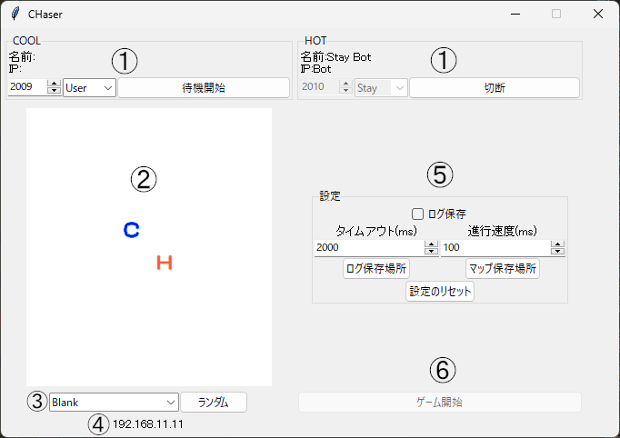

# 概要

旭川版 CHaser (※)のサーバの機能をより拡張し、CHaserの学習を効率化したい。

[※ CHaser には、全国情報技術教育研究会版とそれを簡略化した旭川版があります。](https://ja.wikipedia.org/wiki/CHaser)

## インストール

実行にはPythonの最新版とPillowが必要です  
Pillowは、Pythonインストール後、以下を実行してください  

```PowerPoint
pip install Pillow
```

[ダウンロードリンク](https://github.com/piroping/CHaserServer-HakodateBeta-/releases/download/release/HakodateCHaserBeta.zip)

## 使い方



1. クライアント設定  
    左から、ポート番号、モード、待機接続ボタン  
    モード:  User(通常) Stay(その場待機) Bot(Bot.pyを実行する)
2. マッププレビュー  
    3で指定したマップを表示すします
3. マップ設定  
    mapsフォルダ内から指定します  
    ランダムボタン:mapsフォルダ内からランダムで選択します
4. IPアドレス
    サーバーのIPアドレスを表示します
5. 設定  
    ログ保存:logフォルダに試合のログを保存します  
    タイムアウト:通信のタイムアウト速度を調整します  
    進行速度:ゲームの進行速度を調整します  
    ログ、マップ保存場所:それぞれのフォルダ位置を変更します。
    設定のリセット:上記の設定をすべてリセットします。
6. ゲーム開始  
    クライアントがすべて接続した後使うことができます。  
