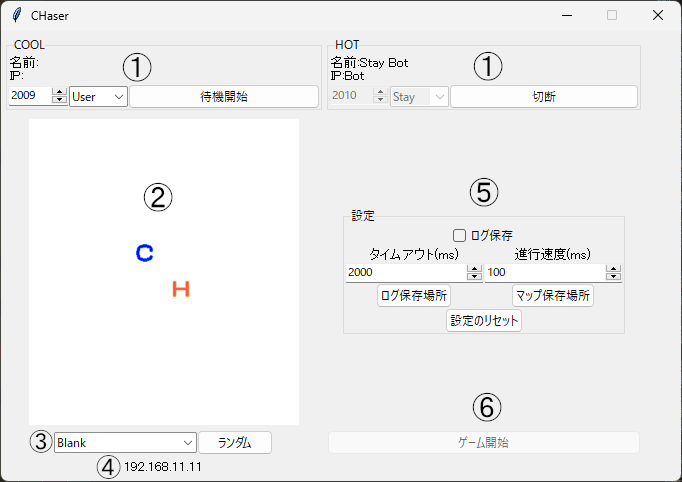
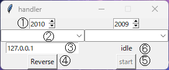

# 概要

旭川版 CHaser (※)のサーバの機能をより拡張し、CHaserの学習を効率化したい。

[※ CHaser には、全国情報技術教育研究会版とそれを簡略化した旭川版があります。](https://ja.wikipedia.org/wiki/CHaser)

## インストール

Githubのリポジトリをダウンロード後、launch.batでサーバを起動できます。
python3.11.3で動作確認をしました。  
Linux版、Mac版は現在制作中です。  
  
また、はじめから2022年の函館大会で使用されたマップが入っています。

## 使い方

### サーバ

1. クライアント設定  
    左から、ポート番号、モード、待機接続ボタン  
    モード:  User(通常) Stay(その場待機) Bot(Bot.pyを実行する)
2. マッププレビュー  
    3で指定したマップを表示すします
3. マップ設定  
    mapsフォルダ内から指定します  
    ランダムボタン:mapsフォルダ内からランダムで選択します
4. IPアドレス
    サーバーのIPアドレスを表示します
5. 設定  
    ログ保存:logフォルダに試合のログを保存します  
    タイムアウト:通信のタイムアウト速度を調整します  
    進行速度:ゲームの進行速度を調整します  
    ログ、マップ保存場所:それぞれのフォルダ位置を変更します。
    設定のリセット:上記の設定をすべてリセットします。
6. ゲーム開始  
    クライアントがすべて接続した後使うことができます。  

### クライアントハンドラ

1. ポート番号  
   接続する先のポートを指定します。（右も同様）
2. ファイル名  
   ./Clients/内にあるプログラムを指定します。（右も同様）
3. IPアドレス  
   接続先のIPアドレスを指定します
4. 反転ボタン  
   ポート番号のみを入れ替えます。
5. 実行ボタン  
   指定されたファイルを実行します。
6. 状態表示  
   idle: 待機中
   running: 実行中

### マップ変換

./util/内にあります。
選択された.mapファイルを.jsonに変換します。 ./map/内に配置されます。
